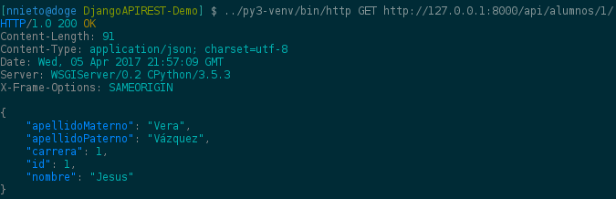

# DjangoAPIREST-Demo

Ejemplo de API REST con Django (primeros pasos)

## Guia rápida con Python 3

Primero debes crear un virtualenv por que yo lo digo.

```bash
python3 -m venv py3-venv
```

El siguiente paso es clonar el repo.

```bash
git clone https://github.com/jatempa/DjangoAPIREST-Demo.git
```

Ahora entramos en el nuevo directorio e instalamos las dependencias.

```bash
cd DjangoAPIREST-Demo
../py3-venv/bin/pip install -r requirements.txt
```

Aplica las migraciones, si es que hay alguna.

```bash
../py3-venv/bin/python manage.py migrate
```

Corre la aplicación:

```bash
../py3-venv/bin/python manage.py runserver
```

Finalmente prueba la aplicación con el navegador, `curl` o mucho mejor
[httpie](https://httpie.org/)!

```bash
http GET http://127.0.0.1:8000/api/carreras
```

Captura de pantalla:



